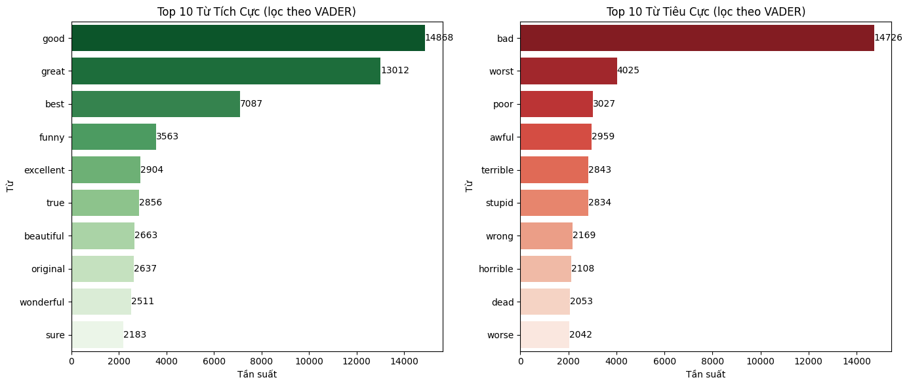
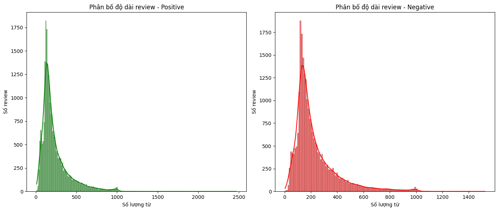
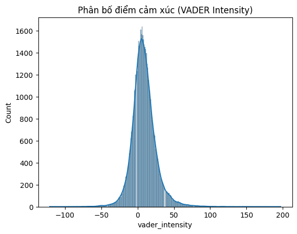

# IMDB Movie Reviews Sentiment Analysis  
**Course Project — Data Processing and Programming Technique**

## Notebook / Colab
- **Colab:** https://colab.research.google.com/drive/1nNgtxrLeLtXljBW_rZaSLdbuIYA9s29v?usp=sharing  
- **Main notebook (repo):** `Project.ipynb`

## Overview
This project explores and analyzes the IMDB movie reviews dataset through **text preprocessing, EDA, and lexicon-based sentiment scoring (VADER)**.  
This is primarily an analysis/visualization project and **does not train a supervised classification model**.

## Dataset
To keep this repository lightweight, the dataset file is **not included**.

Download the dataset from Kaggle:  
https://www.kaggle.com/datasets/lakshmi25npathi/imdb-dataset-of-50k-movie-reviews

## What I did
- Loaded and inspected the dataset (columns, missing values, duplicates)
- Cleaned and normalized review text (steps documented inside the notebook)
- Performed exploratory data analysis (EDA) using plots and word clouds
- Computed sentiment scores using **VADER** and analyzed sentiment intensity patterns

## Figures & Insights

### 1) Top sentiment words (filtered by VADER)

- **What it shows:** Top 10 frequent positive/negative words in reviews (filtered using VADER sentiment lexicon).
- **Key insight:** Positive reviews are dominated by words like *good, great, best*, while negative reviews frequently contain *bad, worst, poor, awful*.
- **Why it matters:** This supports that bag-of-words features (e.g., TF-IDF) can be effective for a baseline sentiment classifier.

### 2) Review length distribution (Positive vs Negative)

- **What it shows:** Distribution of review lengths (word counts) for positive vs negative reviews.
- **Key insight:** Both classes are right-skewed (many short/medium reviews and fewer very long reviews), and the overall shapes look similar.
- **Why it matters:** Review length alone may not separate classes well, but can be used as an additional feature (e.g., word count, average word length).

### 3) VADER sentiment intensity distribution

- **What it shows:** Distribution of sentiment intensity scores computed by VADER across reviews.
- **Key insight:** Scores concentrate around neutral/moderate values with long tails, indicating a mix of weak-to-strong sentiment expressions.
- **Why it matters:** VADER scores (compound/intensity) can be used as engineered features or as a sanity check for label noise and ambiguous reviews.

## Conclusion
This project demonstrates an end-to-end exploratory workflow for IMDB movie reviews using preprocessing, visualization, and **VADER-based** sentiment scoring.  
The analysis highlights common sentiment-related words, similarities in review length distributions between classes, and the overall spread of sentiment intensity across reviews.

## Future Work
- Build supervised baselines (TF-IDF + Logistic Regression / Naive Bayes)
- Try deep learning approaches (LSTM/GRU with TensorFlow)
- Tune preprocessing (lemmatization, n-grams) and compare impact
- Add evaluation metrics (Accuracy, Precision, Recall, F1) and confusion matrix
- Explore interpretability (top TF-IDF features, SHAP/LIME)

## References
- Kaggle IMDB dataset: https://www.kaggle.com/datasets/lakshmi25npathi/imdb-dataset-of-50k-movie-reviews  
- VADER Sentiment: https://github.com/cjhutto/vaderSentiment
